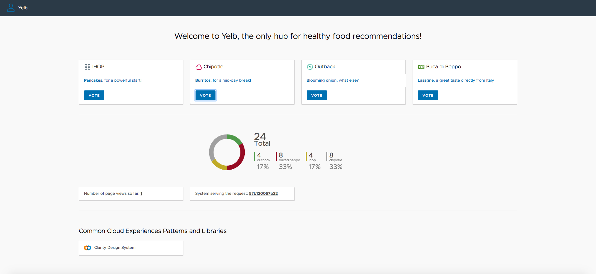

#### AWS Service Connect ECS Terraform Module

#### Yelb architecture

The current architecture layout is pretty straightforward. 

There is a front-end component called `yelb-ui` that is responsable for vending the JS code to the browser. This code is compiled from an Angular 2 application. Depending on the deployment model this code can be served from an instance (EC2), from a container (Docker, Kubernetes, ECS) or from an S3 bucket (serverless). The `yelb-ui` component may also include, depending on the deployment model, an `nginx` proxy. 

At the time of this writing the only application component that exists is `yelb-appserver`. This is a Sinatra application that basically read and write to a cache server (`redis-server`) as well as a Postgres backend database (`yelb-db`). Redis is used to store the number of page views whereas Postgres is used to persist the votes. Note that the `yelb-db` container image is nothing more than Postgres (10) customized to create the database schema the application relies on. In the `serverless` deployment, new system variables has been introduced to support a DynamoDB backend (as a replacement for both redis and postgres).  

The picture below shows the architecture of Yelb:

Note: the picture above is representative of the instance (EC2) based deployment model and the container based deployment model. The serverless deployment model is architecturally different.

#### What does Yelb do?

Yelb allows users to vote on a set of alternatives (restaurants) and dynamically updates pie charts based on number of votes received. In addition to that Yelb keeps track of number of page views as well as it prints the hostname of the `yelb-appserver` instance serving the API request upon a vote or a page refresh. This allows an individual to demo the application solo, or involving people (e.g. an audience during a presentation) asking them to interact by pointing their browser to the application (which will increase the page count) and voting their favorite restaurant.    

This is how the UI looks like at this point:

The nature of the app allows people to experiment with the statless `yelb-ui` and `yelb-appserver` components (think scaling out, blue/green depoyments, etc.) as well as experiment with the stateful `redis-server` and `yelb-db` backend components. 

